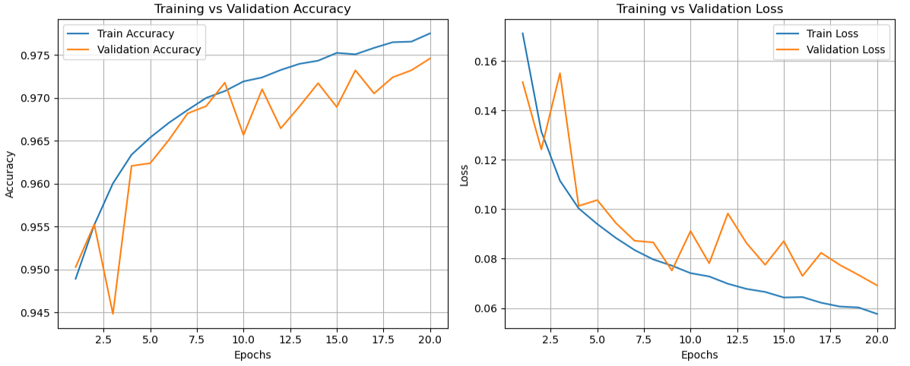
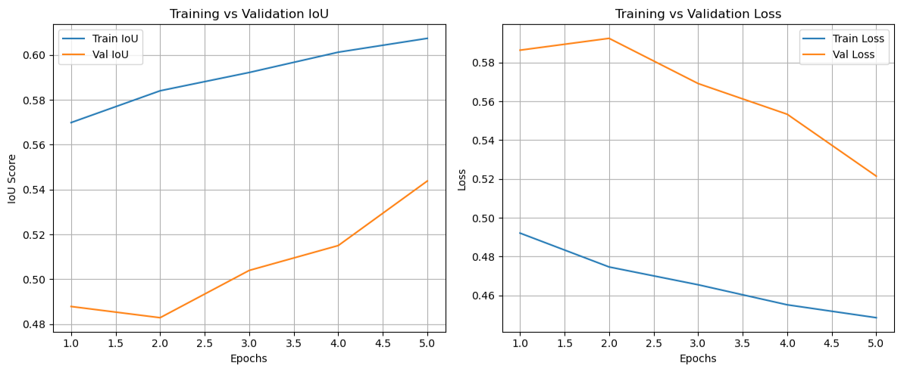
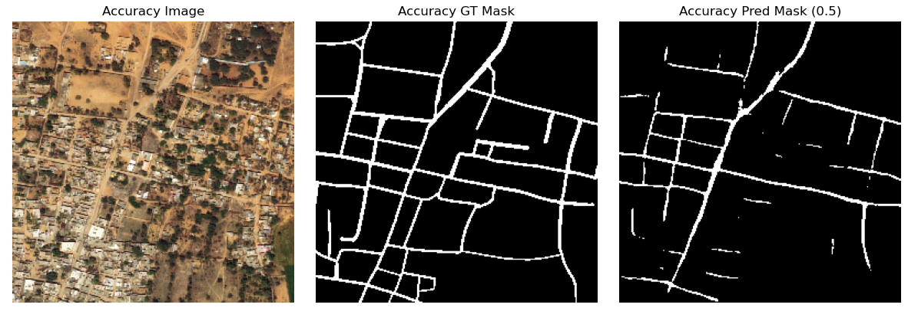
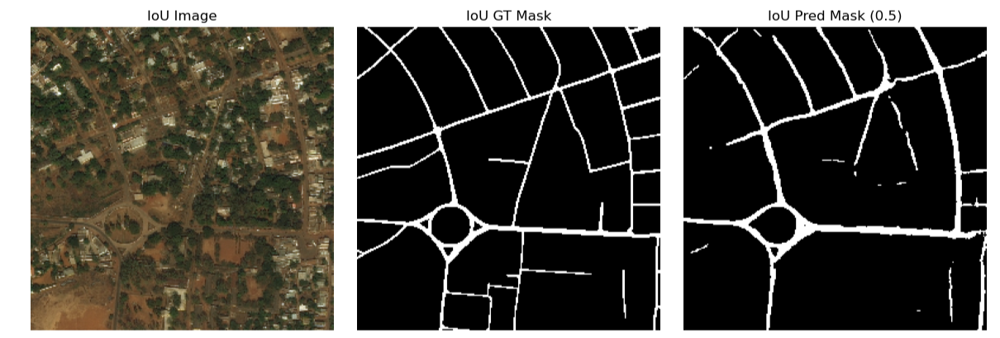

# Satellite Road Segmentation using U-Net

## Overview
This project uses a U-Net model to perform semantic segmentation on satellite imagery, identifying road networks at the pixel level.

The goal is to compare different training strategies and evaluate how well the model can generalize across different environments.

---

## Problem

Road segmentation from satellite imagery presents several challenges:

- Thin, discontinuous road structures
- Class imbalance (most pixels are background)
- Variation across environments (urban vs rural, US vs Middle East)
- High sensitivity to evaluation metric choice

---

## Approach

### Model
- U-Net architecture (encoder-decoder with skip connections)
- 64 → 1024 feature channels
- Pixel-wise binary classification (road vs background)

### Datasets
- DeepGlobe Road Extraction Dataset (Middle East)
- Payne Dataset (U.S. urban areas)

---

## Training Strategies

Two models were trained and compared:

### Accuracy-Based Model
- Loss: Binary Cross-Entropy (BCE)
- Metric: Pixel-wise accuracy

### IoU-Based Model
- Loss: IoU + Dice loss
- Metric: Intersection over Union (IoU)

---

## Results

| Metric        | Accuracy Model | IoU Model |
|--------------|--------------|----------|
| Accuracy     | ~0.97        | ~0.97    |
| IoU Score    | 0.468        | 0.525    |

Key takeaway:
- Accuracy is misleading due to class imbalance
- IoU-based training produces better road continuity and structure

---

## Visual Results

### Training Performance

### IoU Performance

---

## Prediction Examples

### Example 1 (Accuracy-Trained Model)

### Example 2 (IoU-Trained Model)

---

## Key Insights

- IoU-trained model produces smoother, more continuous road structures
- Accuracy-trained model leaves gaps and misses thin roads
- Dataset variation significantly impacts model performance
- Metric choice directly affects learned features

---

## Challenges

- Severe class imbalance (road vs background)
- GPU issues (limited IoU training epochs)
- Detecting thin and curved structures

---

## Future Improvements

- Train IoU model longer with GPU access
- Increase resolution (better thin-road detection)
- Explore multi-class segmentation
- Try models like DeepLab or Mask R-CNN

---

## Tech Stack

- Python
- TensorFlow
- U-Net
- tf.data pipeline
- PyTorch
- Jupyter

---

## Author
Zachary Elias  
Clemson University  
Computer Science/Computer Information Systems

---

## Notes

- Dataset not included due to size
- Results shown are sample outputs for evaluation
